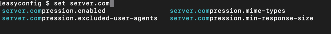
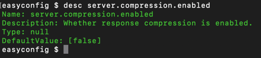
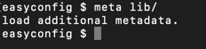

# easyconfig
简单易用的Spring Boot应用程序配置编辑器

# 项目背景
传统编辑`application.properties`文件时是比较存粹的文字编辑，在配置项较长且无法轻松复制的情况下容易出错。为此开发了这个用户友好的Spring Boot应用程序配置编辑器，旨在降低错误发生的可能性和提高配置的可维护性。

# 功能介绍
1. 配置补全提示，避免出错
2. 配置元数据提示，了解配置含义及默认值
3. 支持指定配置元数据目录以便加载更丰富的配置提示信息

# 命令介绍
### 打开配置文件
```` Bash
ec config/application.properties
````
### 编辑配置项
```` Bash
# 设置配置项 'server.port' 的值为 8080, 如果配置项不存在则新增
set server.port 8080
````

### 查看配置值
```` Bash
# 查看配置项 'server.port' 的值
get server.port 
````

### 查看配置描述
```` Bash
# 查看配置项 'server.port' 的描述信息
desc server.port
````

### 移除配置项
```` Bash
# 移除配置项 'server.port'
rm server.port
````

### 保存配置
```` Bash
save
````

### 重置配置
```` Bash
# 将配置项恢复为第一次加载时
reset
````

### 加载配置元数据
```` Bash
# 加载配置元数据目录lib
meta lib
````

### 退出
```` Bash
exit
````

### 查看错误信息
```` Bash
# 查看错误堆栈信息，通常只在调试下使用
stacktrace
````


# 截图示例
### 1.配置补全提示  

### 2. 配置描述  

### 3. 加载自定义的元数据目录  


# 构建本机native
> 1. 安装JDK 21 (必须21，否则无法构建)
> 2. 安装Maven
> 3. 执行`mvn clean package -Pnative`构建native制品包

# 构建跨平台的native
原理：利用不同平台的graalvm镜像构建native制品包
> 1. 安装Docker(必须支持跨平台)
> 2. 执行`mvn clean package -Plinux -Darch=aarch64`  (linux arm64 版本)
> 3. 执行`mvn clean package -Plinux -Darch=amd64`    (linux x86_64 版本)


# 仅构建可执行jar
> 1. 安装JDK 21 (必须21，否则无法构建)
> 2. 安装Maven
> 3. 执行`mvn clean package -Pshade` 仅构建可执行jar
